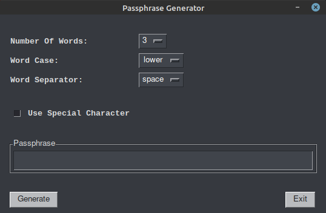
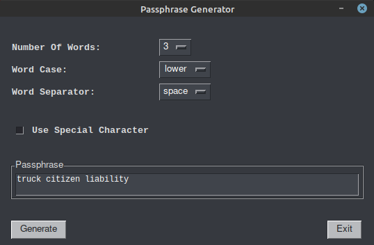
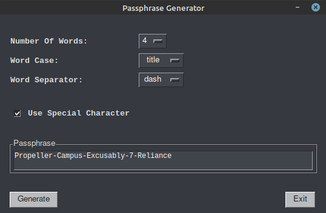
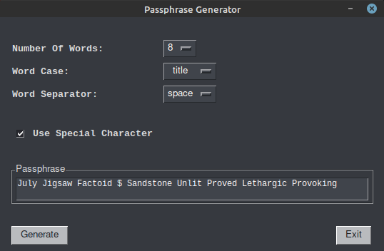

# PyPassphrase

A Python application that creates secure and strong passphrases based on the [Diceware](https://theworld.com/~reinhold/diceware.html) process using [PySimpleGUI](https://pysimplegui.readthedocs.io/en/latest/) for the graphical frontend version.

# Introduction

A number of years ago I read the [xkcd](https://xkcd.com/936/) comic on passphrases over passwords, as I am sure many others have, and was immediately struck with the profoundness of this idea along with its simplicity.  I then set out, where possible to do so, change all my passwords to passphrases.  In fact, I finally felt confident enough in the simplicity and memorability of it all that I even started using hard drive encryption on my Linux machines.  In all the years I have not had one issue remembering the password to unlock my hard drive so I could get to the Operating System and, well, enter another passphrase.  The FBI (well, at least the Portland Office) has come out in [favor](https://www.zdnet.com/article/fbi-recommends-passphrases-over-password-complexity/) of using passphrases over passwords.

Fast forward a few years and we have more and more logins and passwords to track.  Multiple email accounts, social media accounts, mobile devices, laptops, desktops and so on.  Even using passphrases, the task of coming up with unique yet memorable passphrases can be a little daunting.  There are, of course, a plethera of online tools to generate passwords and passphrases.  The question then becomes, can you trust the generator did not generate a password for you, then store it somewhere.

Truthfully, you cannot eliminate this potential entirely if you use any online or other electronic means to generate your password or passphrase. What you find here in the form of my _PyPassphrase_ app is no different.  Without knowing the logic, intentions, etc. you canont really have any certainty.  Most people do not give it much thought and I could be overstating the issue a bit, but when it comes to protecting your data a small bit of paranoid can go a long way.  I have struggled with this as well even when using well established and trusted password managers.  I never really envisioned a reliable solution until I came across a method that seemed to take this parinoia to the nth level.

# The Diceware Method

The [Diceware Method](https://theworld.com/~reinhold/diceware.html) created by Arnold G. Reinhold is probably the epitome of secure passphrase creation.  No computer, no electronics, nothing digital is really needed.  Just some dice, a word list and a little time.  It is about as secure of a method for generating passphrases that can be found.

I do not see a great number of people rushing out to buy some quality dice and spending the time needed to go through the Dicware process.  There will, of course, be those that do, but for the rest of us, what you find here in this application is an effort to model that process using Python.  The word list used is from the [Electronic Frontier Foundation](https://www.eff.org/deeplinks/2016/07/new-wordlists-random-passphrases).  The special character list is taken straight from the Diceware process only being modified to remove those characters that are ambiguous or similar to letters of the alphabet.

The dice rolls are modeled using the Python [secrets](https://docs.python.org/3/library/secrets.html) module as does the selection of the optional special character.

# Usage

There are two versions of this available.  A graphical (GUI) and non-graphical version.  I kept the non-graphical version around simply for those that prefer that.  My original concept that I worked out on paper was always inteded to be a GUI version.  The non-graphical version is what I used to develop the code and work out the bugs I could find before adding the PySimpleGUI frontend.

There are four options available to customize the passphrase:

1.  User defined number of words from 2 - 8

You really don't want to use a passphrase of only two words, but is provided as an option for trivial password protection.  Three words would be the absolute minimum (non-critical applications) and four would be sufficient.  Unless you have a really good memory and confident you can remember such passphrases, or are using a good password manager such as [Keepass](https://keepass.info/), [KeepassXC](https://keepassxc.org/) or its variants for mobile applications, I would not recommend anything over 6 words.

2. User defined letter case (lower case, upper case, title case)

Using a mixed case passphrase makes the passphrase a bit more secure.  Some prefer all lower case as it is sometimes easier and more reliably typed out.  However, if you are using a password manager I would strongly recommend that at a minimum title case be used.

3. Word separator

There are only two options here, either an empty space or a dash.

4. Special characters

The user has the option to use or not use a special character in their passphrase.  The special characters available include the numbers 2 - 9 along with other special characters commonly used in passwords such as the ampersand (`&`), the at symbol (`@`), exclamation point (`!`), etc.  If this option is chosen, it will will be placed in a random location within the passphrase.

You can, of course manually add your own special character if you so choose.  Just copy and paste the passphrase and modify as needed.

# Screenshots

# Windows Executable

If you would like to build a windows executable file from the Python source code you need to install a Python package `pyinstaller`. This can be done using `pip3`.

`pip3 install pyinstaller`

After that has completed, and from the same directory that the python main file is in, you run the following command:

`pyinstaller --onefile -w pynslookup.py`

The `--onefile` option instructs pyinstaller to create just one executable file. The `-w` option suppresses the command window from opening. When the process has completed you will find the windows executable (.exe) in the dist folder. Since this is a relatively simple application it will run as a stand alone file on the Windows operating system.

# Conclusion

It is my hope that you find this useful.  It has been a blast working through the process to turn this out.  I have tried to remain as faithful as I am able to the original Diceware process.  

If you want to check the strength of your generated passphrase, there are many online resources for that.  One such resource is the[University of Illinois at Chicago](https://www.uic.edu/apps/strong-password/).  Another is [Comparitech](https://www.comparitech.com/privacy-security-tools/password-strength-test/).  Of course, this too comes with the same caveat as with generating passwords or passphrases using online resources.  However, you could always generate one or two using different numbers of words and customizations and see how strong the result is, then generate a final one for actual use.